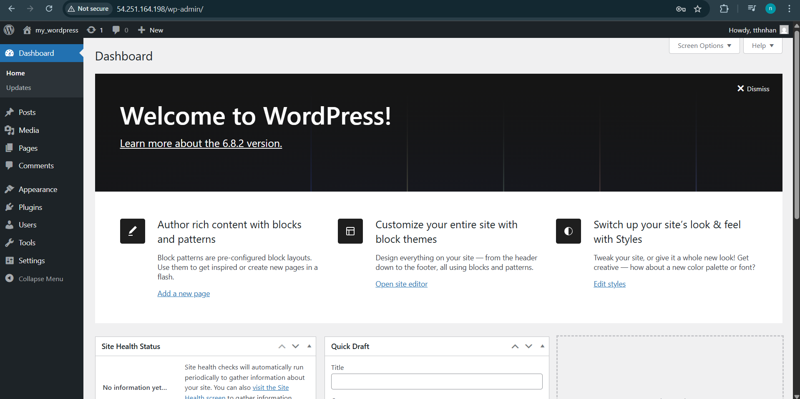

# Secure-WordPress-Deployment-on-AWS

## 📌 Overview
This project demonstrates how to deploy WordPress securely on AWS using a **Public–Private Subnet architecture**.

- Public Subnet: Nginx reverse proxy (with Elastic IP).
- Private Subnet: Apache + WordPress + MySQL.
- NAT Gateway: allows Private Subnet to access the Internet for updates.
- Internet Gateway: provides external access only to the Public Subnet.

## 🏗️ Architecture

## ⚙️ Tech Stack
- **AWS VPC, Subnet, Route Table, NAT Gateway, Internet Gateway**
- **EC2 (Nginx, Apache, MySQL, WordPress)**

## Result

