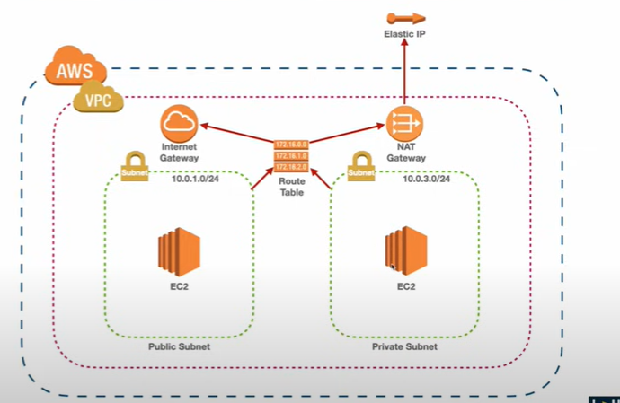

# Secure-WordPress-Deployment-on-AWS


## 📌 Overview
This project demonstrates how to deploy WordPress securely on AWS using a **Public–Private Subnet architecture**.

- Public Subnet: Nginx reverse proxy (with Elastic IP).
- Private Subnet: Apache + WordPress + MySQL.
- NAT Gateway: allows Private Subnet to access the Internet for updates.
- Internet Gateway: provides external access only to the Public Subnet.

## 🏗️ Architecture


## ⚙️ Tech Stack
- **AWS VPC, Subnet, Route Table, NAT Gateway, Internet Gateway**
- **EC2 (Nginx, Apache, MySQL, WordPress)**
- **Let’s Encrypt SSL**

## 🚀 Deployment Steps
1. Create VPC, subnets, route tables, IGW, NAT Gateway.
2. Launch EC2 Public (Nginx reverse proxy).
3. Launch EC2 Private (Apache, MySQL, WordPress).
4. Configure MySQL:
   ```sql
   CREATE DATABASE wordpress;
   CREATE USER 'iamnhan'@'localhost' IDENTIFIED BY 'strong_password';
   GRANT ALL PRIVILEGES ON wordpress.* TO 'iamnhan'@'localhost';
   FLUSH PRIVILEGES;
